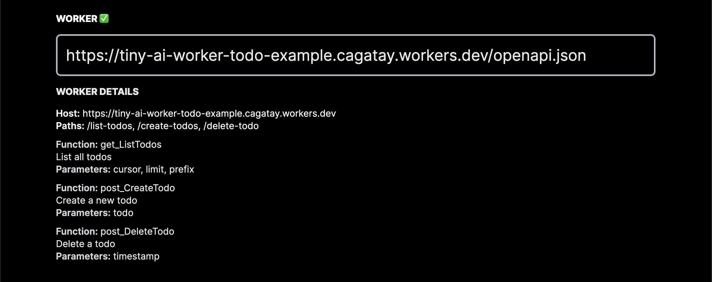

# Tiny AI Example Worker: Todo List

[](https://tiny.technology)

<!-- One click deploy to cloudflare -->
[](https://deploy.workers.cloudflare.com/?url=https://github.com/tinyai-id/tiny-ai-worker-todo-example)

This is an example of a Cloudflare Worker that uses Cloudflare Workers KV to store a simple todo list. It is a part of the Tiny AI platform.

# Try before you deploy

Visit tiny.technology and attach as Worker to your chat.

URL: https://tiny-ai-worker-todo-example.cagatay.workers.dev/openapi.json

Result should be similar:


# Prerequisites

- Node.js
- Wrangler CLI
- Cloudflare Workers account
- Cloudflare Workers KV


# Configuration
- Create a new Cloudflare Workers KV namespace
> https://developers.cloudflare.com/kv/reference/how-kv-works/
- Update the wrangler.toml file with your Cloudflare account ID and KV namespace ID

```
kv_namespaces = [
  { binding = "TODO_LIST", id = "YOUR_KV_NAMESPACE_ID" }
]
```

# Installation

```bash
git clone git@github.com:TinyAI-ID/tiny-ai-worker-todo-example.git;
cd tiny-ai-worker-todo-example;
npm install;
```

# Usage

```bash
wrangler publish
```

# Development

```bash
wrangler dev
```

# License
MIT-0